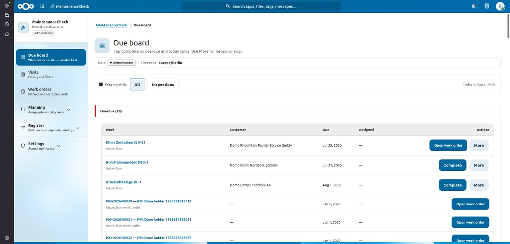
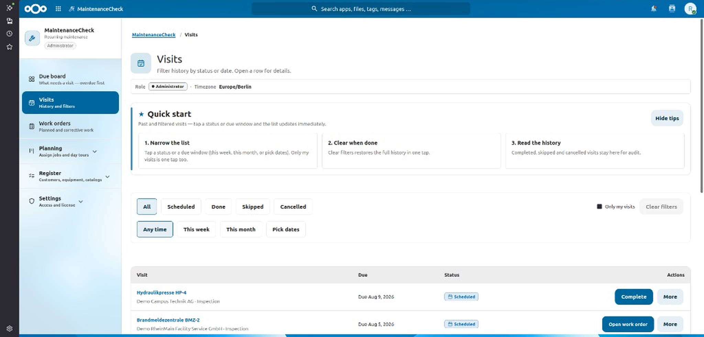
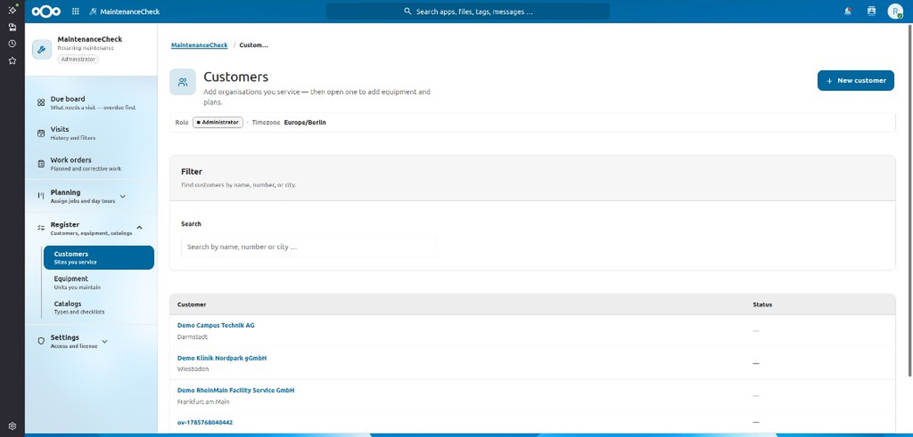
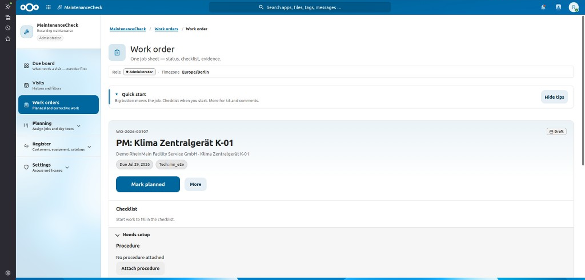

# MaintenanceCheck

[](https://nextcloud.com/)
[](https://www.php.net/)
[](LICENSE)

**[English](#english)** · **[Deutsch](#deutsch)**

---

## Screenshots

<p align="center">
  
  
</p>
<p align="center">
  
  
</p>

More views: [4](screenshots/maintenancecheck-screenshot-04.png) · [6](screenshots/maintenancecheck-screenshot-06.png) · [7](screenshots/maintenancecheck-screenshot-07.png) · [8](screenshots/maintenancecheck-screenshot-08.png)

---

## English

**Know what is due. Close it in the field.**

MaintenanceCheck runs recurring and corrective maintenance on the Nextcloud you already host. Customers, sites and equipment live in one register. Visits follow a calendar or meter plan. Due work becomes a work order with checklists, photos and an optional signature — then a Servicebericht PDF for the office.

**Free web app** (AGPL-3.0-or-later). Companion apps: https://nextcloud.software-by-design.de/

### Why teams install it

- Due board: overdue, today, next 7 days and ahead — plus open work orders
- Work orders with conditional checklists, photos, optional signature; kits and skills gates
- Dispatch, day tours, capacity hints, exception board, ops KPI (CSV)
- Register with printable QR stickers; corrective intake and recurring inspections (Prüfnachweis PDF)
- Office / technician roles, optional allow-list, overdue Notifications

### Clear limits

- Prüfnachweis PDFs are operational evidence — not legal certificates. Checklists are templates, not legal advice.
- Customers are a field register. Same name elsewhere ≠ same record. See [docs/FIELD-DUAL-CUSTOMER.md](docs/FIELD-DUAL-CUSTOMER.md).
- Optional stock deduction after close stays off by default and never blocks finishing a job.

### Requirements

- Nextcloud 32–34 · PHP 8.2–8.5 · MySQL/MariaDB or PostgreSQL

### Install from Git

```bash
cd /path/to/nextcloud/apps/
git clone https://github.com/aSoftwareByDesignRepository/nextcloud-maintenancecheck.git maintenancecheck
cd maintenancecheck
composer install --no-dev
```

Enable the app in Nextcloud (Apps → MaintenanceCheck) or run `php occ app:enable maintenancecheck`.

### Development

```bash
composer install
./vendor/bin/phpunit
```

For Playwright E2E against a local Nextcloud, copy `tests/e2e/.env.example` to `tests/e2e/.env`, set passwords locally, then run `scripts/e2e-prep.sh`.

### Security

Do not open public issues that contain production secrets, personal data, or internal hostnames. Report vulnerabilities privately — see [SECURITY.md](SECURITY.md).

### Project & support

**Software by Design GbR** · [nextcloud.software-by-design.de](https://nextcloud.software-by-design.de/) · [info@software-by-design.de](mailto:info@software-by-design.de)  
[GitHub Sponsors](https://github.com/sponsors/aSoftwareByDesignRepository) · [Support packages](https://nextcloud.software-by-design.de/en/support.html#packages)

### License

[AGPL-3.0-or-later](LICENSE).

---

## Deutsch

**Sehen, was fällig ist. Im Einsatz abschließen.**

MaintenanceCheck steuert wiederkehrende und korrigierende Wartung in der Nextcloud, die Sie schon betreiben. Kunden, Standorte und Anlagen in einem Register. Termine nach Kalender oder Zähler. Aus Fälligkeiten werden Arbeitsaufträge mit Checklisten, Fotos und optionaler Unterschrift — danach ein Servicebericht-PDF fürs Büro.

**Kostenlose Web-App** (AGPL-3.0-or-later). Companion-Apps: https://nextcloud.software-by-design.de/

### Warum Teams es einsetzen

- Fälligkeitsboard: überfällig, heute, nächste 7 Tage und danach — plus offene Aufträge
- Arbeitsaufträge mit Checklisten, Fotos, optionaler Unterschrift; Kits und Qualifikationen
- Disposition, Tagestouren, Kapazität, Ausnahmeboard, Ops-KPI (CSV)
- Register mit QR-Aufklebern; Korrekturaufträge und wiederkehrende Prüfungen (Prüfnachweis-PDF)
- Büro-/Techniker-Rollen, optionale Freigabeliste, überfällige Benachrichtigungen

### Klare Grenzen

- Prüfnachweis-PDFs sind betriebliche Nachweise — keine Rechtszertifikate. Checklisten sind Vorlagen, keine Rechtsberatung.
- Kunden sind ein Außenregister. Gleicher Name anderswo ≠ derselbe Datensatz. Details: [docs/FIELD-DUAL-CUSTOMER.md](docs/FIELD-DUAL-CUSTOMER.md).
- Optionale Bestandsabzüge nach Abschluss bleiben standardmäßig aus und blockieren den Abschluss nicht.

### Voraussetzungen

- Nextcloud 32–34 · PHP 8.2–8.5 · MySQL/MariaDB oder PostgreSQL

### Installation aus Git

```bash
cd /path/to/nextcloud/apps/
git clone https://github.com/aSoftwareByDesignRepository/nextcloud-maintenancecheck.git maintenancecheck
cd maintenancecheck
composer install --no-dev
```

App in Nextcloud aktivieren (Apps → MaintenanceCheck) oder `php occ app:enable maintenancecheck`.

### Sicherheit

Keine öffentlichen Issues mit Produktionsgeheimnissen, personenbezogenen Daten oder internen Hostnamen. Sicherheitsmeldungen privat — siehe [SECURITY.md](SECURITY.md).

### Projekt & Support

**Software by Design GbR** · [nextcloud.software-by-design.de](https://nextcloud.software-by-design.de/) · [info@software-by-design.de](mailto:info@software-by-design.de)  
[GitHub Sponsors](https://github.com/sponsors/aSoftwareByDesignRepository) · [Support-Pakete](https://nextcloud.software-by-design.de/de/support.html#packages)

### Lizenz

[AGPL-3.0-or-later](LICENSE).
